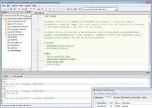
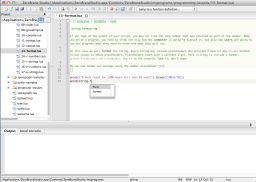
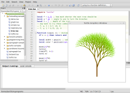
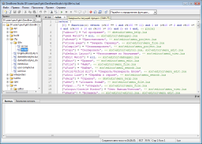
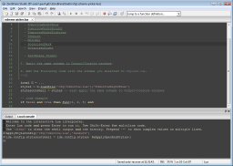

**Debugging with Stack view**

**Static analyzer**

**Interactive console and Unicode**

**Auto-complete on MacOS**

**Live coding on Linux**

**Live coding on a mobile device**

**Integrated Markdown formatting**

**Internationalization support**

**Color schemes**

