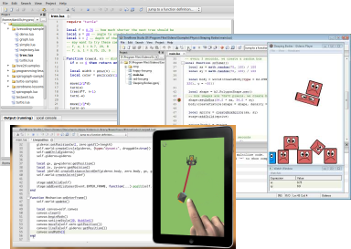

# Support ZeroBrane Studio. Pay what you want. Download and run in 30 seconds.

<form action="https://checkout.google.com/api/checkout/v2/checkoutForm/Merchant/266673609981574" id="BB_BuyButtonForm" method="post" name="BB_BuyButtonForm" target="_top">
 <table class="payment" id="payment-options">
  <tr><td class="amount">  $5</td><td class="description"><input name="item_price_1" id="amount5" value="5" type="radio" /><label for="amount5">This is better than chocolate Mocha</label></td></tr>
  <tr><td class="amount"> $10</td><td class="description"><input name="item_price_1" id="amount10" value="10" type="radio" /><label for="amount10">I will pay more when my game sells</label></td></tr>
  <tr><td class="amount"> $24</td><td class="description"><input name="item_price_1" id="amount24" checked="checked" value="24" type="radio" /><label for="amount24"><strong>Exactly what I was looking for</strong></label></td></tr>
  <tr><td class="amount"> $50</td><td class="description"><input name="item_price_1" id="amount50" value="50" type="radio" /><label for="amount50">I feel lucky and generous today</label></td></tr>
  <tr><td class="amount">$100</td><td class="description"><input name="item_price_1" id="amount100" value="100" type="radio" /><label for="amount100">Take my money; just keep working on it</label></td></tr>
 </table>

 <input name="item_name_1" type="hidden" value="ZeroBrane Studio"/>
 <input name="item_description_1" type="hidden" value=""/>
 <input name="item_quantity_1" type="hidden" value="1"/>
 <input name="item_currency_1" type="hidden" value="USD"/>
 <input name="shopping-cart.items.item-1.digital-content.url" type="hidden" value="http://studio.zerobrane.com/download.html?google-wallet"/>
 <input name="_charset_" type="hidden" value="utf-8"/>

 

  <input class="payment-button" alt="" src="https://checkout.google.com/buttons/buy.gif?merchant_id=266673609981574&amp;w=117&amp;h=48&amp;style=white&amp;variant=text&amp;loc=en_US" type="image"/>
  <a href="download.html?not-this-time" id="no-payment-text">Take me to the download page this time &#187;</a>
 

</form>

&nbsp;

## What do I get?
You get packages for three platforms:
**Windows** XP or later (zip or self-extracting archive), **Mac OS X** 10.6.8+ (dmg file), or **Linux** (shell archive for Debian, Ubuntu, Xubuntu, Mint, ArchLinux, Fedora, Gentoo and other distributions).

## How much do I pay?
This is completely up to you. How much do you value being able to find
an issue with your code in 5 minutes instead of 15? Get your mobile 
application out faster? Have fun helping your kids or friends learn
programming using Lua and examples included with the IDE?

## Isn't this an open source project?
Yes and we make it easy for you to get code from GitHub and
run it from a cloned copy or an archive. We would still **appreciate your 
payment in support of this project.** If you decide not to provide financial
support this time, please consider spreading the word, contributing code,
helping with [fixes](https://github.com/pkulchenko/ZeroBraneStudio/issues)
or [documentation](documentation.html),
and answering questions other users may have.
