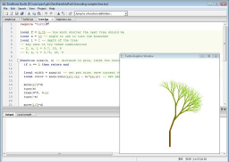
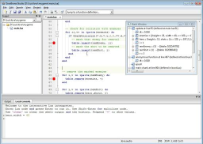
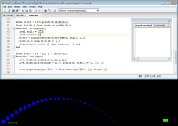
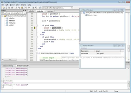
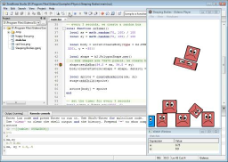
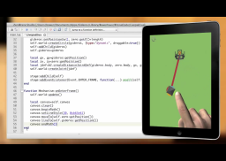

**Tutorial 1: Live coding in Lua**

[Live coding in Lua](http://notebook.kulchenko.com/zerobrane/live-coding-in-lua-bret-victor-style)
demonstrates how to use _live coding_ with different scripts running in ZeroBrane Studio.

**Tutorial 2: Löve debugging**

[Löve debugging](http://notebook.kulchenko.com/zerobrane/love2d-debugging)
demonstrates _debugging and auto-complete_ support for [Löve 2D game engine](http://love2d.org/).

**Tutorial 3: Live coding with Löve**

[Live coding with Löve](http://notebook.kulchenko.com/zerobrane/live-coding-with-love) tutorial
demonstrates how to use _live coding to change game parameters_ using [Löve 2D](http://love2d.org/)
scripts running in ZeroBrane Studio.

**Tutorial 4: Moai debugging**

[Moai debugging](http://notebook.kulchenko.com/zerobrane/moai-debugging-with-zerobrane-studio) tutorial
demonstrates how to configure and use debugging with [Moai 2D game engine](http://getmoai.com/)
by showing _Stack and Watch views, remote console, updating variables,
breakpoints, and stepping through the code_.

**Tutorial 5: Gideros debugging**

[Gideros debugging](http://notebook.kulchenko.com/zerobrane/Gideros-debugging-with-zerobrane-studio-ide) tutorial
demonstrates how to configure and use debugging with [Gideros SDK](http://giderosmobile.com/)
by showing _Watch view, remote console, updating variables,
breakpoints, and stepping through the code_.

**Tutorial 6: Gideros live coding**

[Gideros live coding](http://notebook.kulchenko.com/zerobrane/gideros-live-coding-with-zerobrane-studio-ide) demonstration
by [Andy Bower](http://bowerhaus.eu/blog/files/live_coding.html) shows how to 
use _live coding_ (Run as Scratchpad) with [Gideros SDK](http://giderosmobile.com/) to develop an 
application running on an actual device in real-time.
